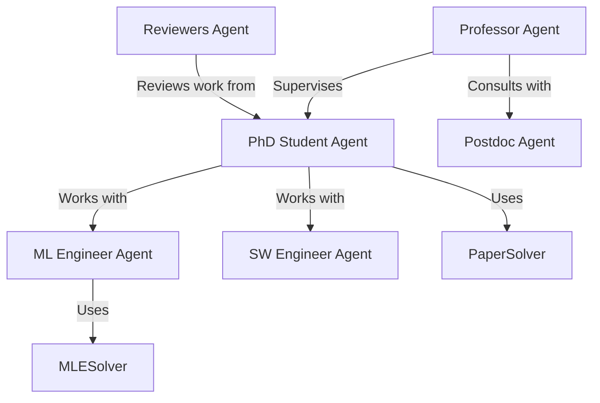

# Agent Types

This document describes the different agent types available in Agent Laboratory and their roles in the research workflow.

## Overview

Agent Laboratory uses a collection of specialized agents, each with unique capabilities and roles. These agents work together to complete different phases of the research process, from literature review to report writing.

## Core Agents

### Professor Agent

**Role**: Senior research supervisor who guides the overall research direction.

**Responsibilities**:
- Providing high-level research guidance
- Reviewing and critiquing work from other agents
- Suggesting improvements and research directions
- Making final decisions on research approaches

**Key Methods**:
- `role_description()`: Defines the professor's role and expertise
- `context(phase)`: Provides phase-specific context
- `phase_prompt(phase)`: Generates phase-specific prompts

### PhD Student Agent

**Role**: Primary researcher who executes the bulk of the research work.

**Responsibilities**:
- Conducting literature reviews
- Implementing research plans
- Running experiments
- Writing initial drafts of reports

**Key Methods**:
- `role_description()`: Defines the PhD student's capabilities and focus
- `context(phase)`: Provides phase-specific context
- `phase_prompt(phase)`: Generates phase-specific prompts

### Postdoc Agent

**Role**: Experienced researcher who provides specialized expertise.

**Responsibilities**:
- Offering deeper technical insights
- Reviewing methodological approaches
- Suggesting advanced techniques
- Helping troubleshoot complex problems

**Key Methods**:
- `role_description()`: Defines the postdoc's specialized knowledge areas
- `context(phase)`: Provides phase-specific context
- `phase_prompt(phase)`: Generates phase-specific prompts

### ML Engineer Agent

**Role**: Specialist in machine learning implementation and experimentation.

**Responsibilities**:
- Designing machine learning experiments
- Implementing models and algorithms
- Analyzing experimental results
- Optimizing model performance

**Key Methods**:
- `role_description()`: Defines the ML engineer's technical capabilities
- `context(phase)`: Provides ML-focused context for each phase
- `phase_prompt(phase)`: Generates ML-specific prompts
- `solve()`: Executes ML experiments (via MLESolver)

### SW Engineer Agent

**Role**: Software engineering specialist focused on code quality and architecture.

**Responsibilities**:
- Designing software architecture
- Ensuring code quality and best practices
- Implementing efficient algorithms
- Reviewing and refactoring code

**Key Methods**:
- `role_description()`: Defines the SW engineer's technical focus
- `context(phase)`: Provides software development context
- `phase_prompt(phase)`: Generates software-focused prompts

### Reviewers Agent

**Role**: External reviewers who provide critical feedback.

**Responsibilities**:
- Critically evaluating research plans and reports
- Identifying weaknesses and limitations
- Suggesting improvements
- Checking for scientific rigor and clarity

**Key Methods**:
- `inference(plan, report)`: Reviews plans or reports and provides feedback

## Specialized Solvers

### MLESolver

**Purpose**: Specialized component for machine learning experiments.

**Capabilities**:
- Running Python code for experiments
- Managing computational resources
- Handling data processing
- Generating visualizations

**Key Methods**:
- `solve()`: Main entry point for ML experiments
- `run_code()`: Executes Python code
- `reflect_code()`: Analyzes code execution results
- `process_command()`: Handles specialized commands

### PaperSolver

**Purpose**: Specialized component for generating research reports.

**Capabilities**:
- Generating LaTeX documents
- Formatting research reports
- Creating bibliographies
- Compiling PDFs

**Key Methods**:
- `solve()`: Main entry point for report generation
- `gen_initial_report()`: Creates initial report structure
- `process_command()`: Handles specialized commands for report creation

## Agent Interactions

Agents interact in different ways depending on the research phase:



## Phase-Specific Agent Roles

Different agents are more active in different phases of the research workflow:

| Phase | Primary Agents | Supporting Agents |
|-------|---------------|-------------------|
| Literature Review | PhD Student, Professor | Postdoc |
| Plan Formulation | Professor, PhD Student | Postdoc, Reviewers |
| Data Preparation | PhD Student, ML Engineer | SW Engineer |
| Running Experiments | ML Engineer, PhD Student | SW Engineer, Postdoc |
| Results Interpretation | PhD Student, Professor | ML Engineer, Postdoc |
| Report Writing | PhD Student | Professor, Reviewers |

## Agent Memory and State

Each agent maintains its own memory of the research process, including:
- Previous conversations
- Key insights and decisions
- Research artifacts created in each phase

This memory allows agents to maintain context across different phases of the research workflow.

## Customizing Agents

Agent Laboratory allows for customization of existing agents and creation of new agent types:

- Extend the `BaseAgent` class to create new agent types
- Override `role_description()`, `context(phase)`, and `phase_prompt(phase)` methods
- Register new agent types in the `LaboratoryWorkflow` class

For more details on creating custom agents, see the [Customizing Agents](./customizing_agents.md) guide.

## Implementation Details

Agent implementations can be found in the `agent_lab/agents/` directory:

```
agent_lab/agents/
├── __init__.py
├── professor_agent.py
├── phd_student_agent.py
├── postdoc_agent.py
├── ml_engineer_agent.py
├── sw_engineer_agent.py
├── reviewers_agent.py
├── solvers/
│   ├── __init__.py
│   ├── mlesolver.py
│   └── papersolver.py
```

Each agent is implemented as a separate class that inherits from the `BaseAgent` class defined in `agent_lab/core/base_agent.py`. 