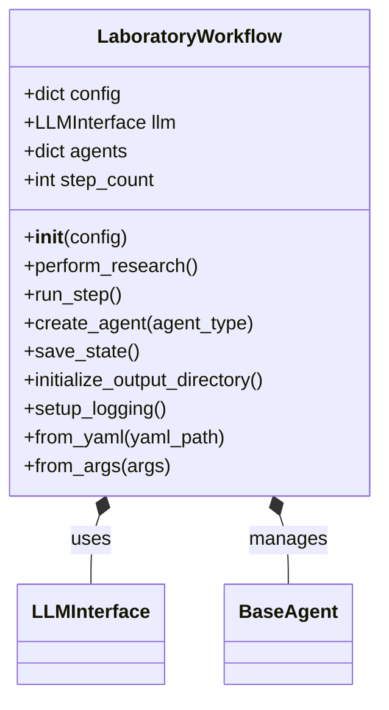
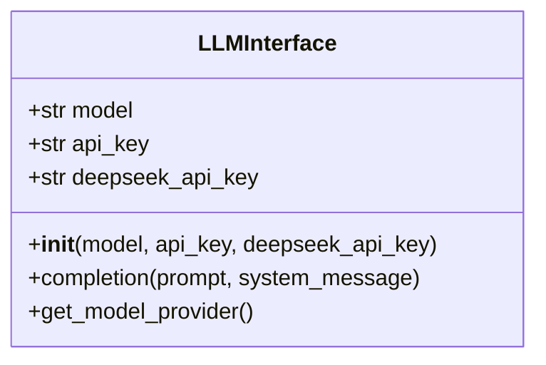
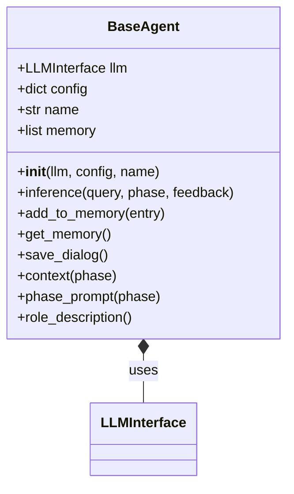
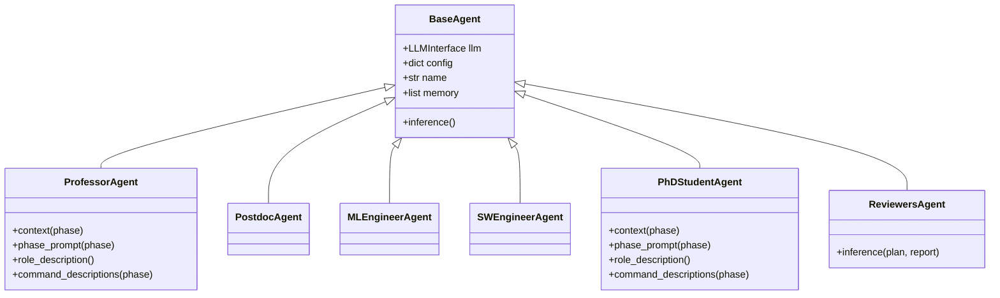
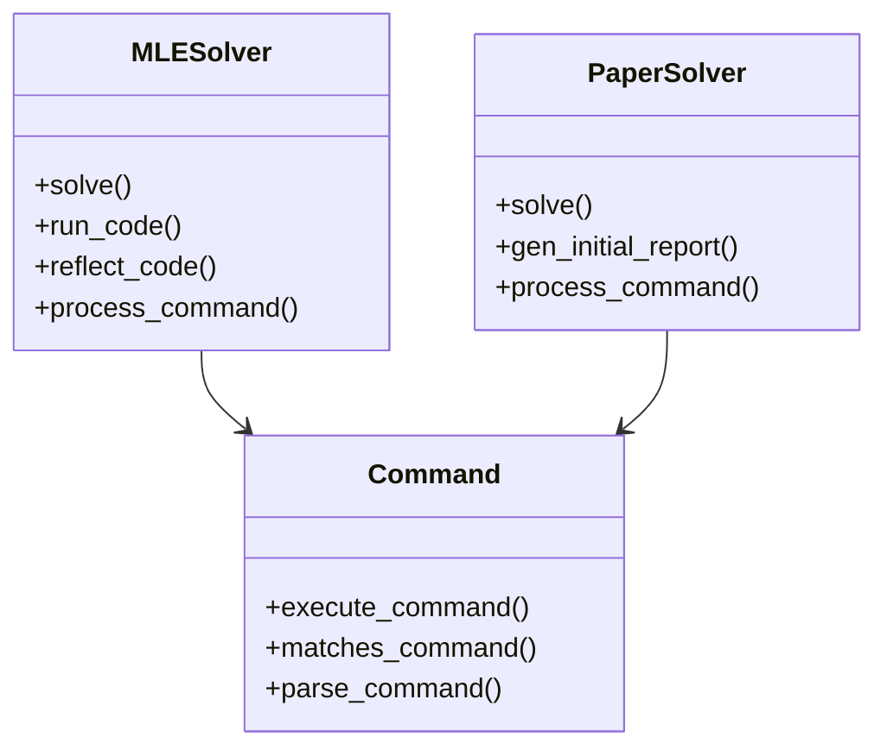
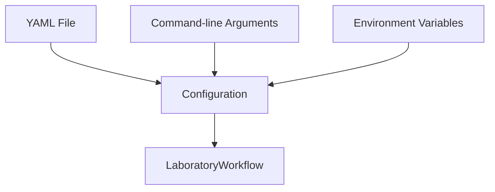
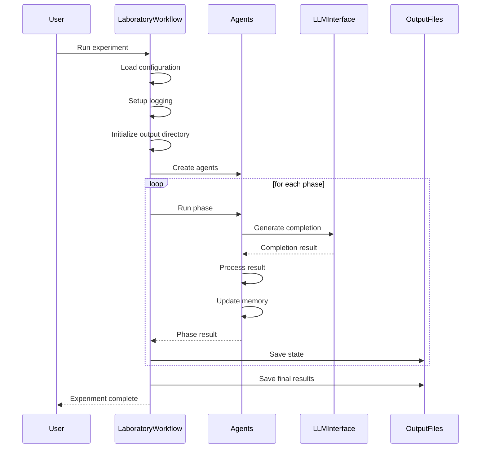
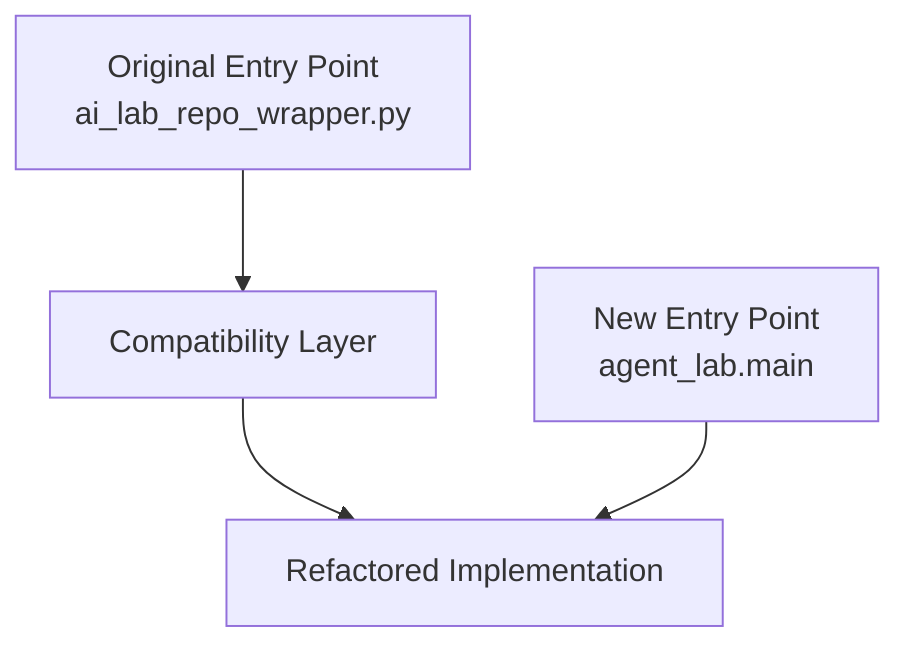
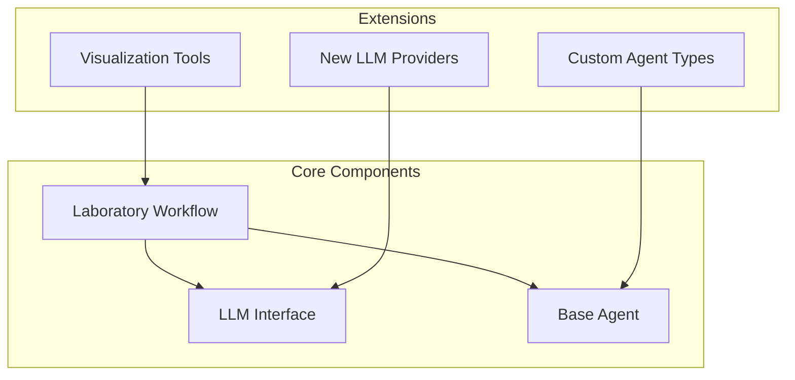

# Agent Laboratory Architecture

This document provides an overview of the architecture for the Agent Laboratory framework.

## System Overview

The Agent Laboratory is a framework for conducting research on multi-agent systems. It provides a structured way to define, run, and analyze experiments with various agent types, configurations, and tasks.

The system is designed to be modular, extensible, and easy to use, with a focus on reproducibility and analysis of results.

## Directory Structure

```
agent_lab/
├── agents/             # Agent implementations
│   ├── solvers/        # Specialized solver agents (MLESolver, PaperSolver)
│   └── ...             # Other agent implementations
├── config/             # Configuration management
├── core/               # Core functionality
│   ├── laboratory_workflow.py  # Main workflow implementation
│   ├── llm_interface.py        # LLM integration
│   └── base_agent.py           # Base agent class
├── io/                 # Input/output utilities
├── logging/            # Logging functionality
├── docs/               # Documentation
├── utils/              # General utilities
└── visualization/      # Visualization tools
```

## Core Components

### Workflow

The `LaboratoryWorkflow` class serves as the main entry point for running experiments. It manages the overall flow of the experiment, including setting up agents, running steps, and saving results.



### LLM Interface

The `LLMInterface` class provides a unified interface for interacting with various language models (e.g., OpenAI, DeepSeek).



### Base Agent

The `BaseAgent` class serves as the foundation for all agent implementations. It provides common functionality for managing memory, generating prompts, and saving dialog.



## Agents

Various agent implementations extend the `BaseAgent` class to provide specialized functionality.



## Solver Components



## Configuration

The configuration module provides functionality for loading and validating configuration from various sources (YAML files, command-line arguments, environment variables).



## Data Flow

The following diagram illustrates the flow of data through the system during a typical experiment.



## Compatibility Layer

To ensure backward compatibility with the original implementation, the system includes a compatibility layer.



## Command-Line Interface

The Agent Laboratory can be invoked in multiple ways:

1. **Using the compatibility wrapper**:
   ```
   python ai_lab_repo_wrapper.py --yaml-location experiment_configs/POMDP_ActiveInference.yaml
   ```

2. **Using the new module directly**:
   ```
   python -m agent_lab.main --config experiment_configs/POMDP_ActiveInference.yaml
   ```

3. **Using the installed package**:
   ```
   agent-lab --config experiment_configs/POMDP_ActiveInference.yaml
   ```

Note that the command-line arguments changed in the refactored version:
- Original: `--yaml-location` → New: `--config`
- Original: `--llm-backend` → New: Model specified in config
- Additional new options: `--debug`, `--phase`, `--resume`

## Extensibility

The Agent Laboratory is designed to be easily extensible. New agent types, LLM interfaces, and visualization tools can be added without modifying the core components.



## Workflow Phases

The research workflow is divided into several distinct phases:

1. **Literature Review**
   - Gathering and analyzing relevant research papers
   - Identifying key concepts and approaches
   - Summarizing state of the art

2. **Plan Formulation**
   - Defining research objectives
   - Outlining experiments
   - Selecting methodologies

3. **Data Preparation**
   - Creating or obtaining datasets
   - Preprocessing data
   - Setting up experimental environments

4. **Running Experiments**
   - Executing experimental code
   - Collecting results
   - Monitoring progress

5. **Results Interpretation**
   - Analyzing experimental outcomes
   - Comparing with baselines
   - Drawing conclusions

6. **Report Writing**
   - Documenting methodology
   - Presenting results
   - Discussing implications

Each phase involves specific agents with roles tailored to the requirements of that phase.

## Output and Visualization

The system generates various outputs:

- **Dialog Logs**: Records of all agent interactions
- **Experiment Artifacts**: Code, data, and results
- **Visualization**: Interactive graphs of agent interactions
- **Reports**: Final research reports in LaTeX/PDF format

The visualization tools help analyze:
- Agent interaction patterns
- Time spent in each phase
- Information flow between agents
- Decision points and branches

## Error Handling and Recovery

The system includes mechanisms for:
- Saving state at regular intervals
- Resuming from a saved state
- Handling errors gracefully
- Providing debug information

## Future Extensions

Planned extensions to the architecture include:
- Support for distributed agent execution
- Integration with external tools and services
- Enhanced visualization capabilities
- More specialized agent types
- Improved memory and reasoning models

## Technical Implementation Notes

- Python 3.10+ is required
- Dependencies are managed through pip/requirements.txt
- Configuration uses YAML with environment variable substitution
- Logging leverages Python's standard logging module with enhancements
- Visualization is implemented using HTML/JavaScript for interactivity 