# Agent Laboratory Documentation

Welcome to the Agent Laboratory documentation. This documentation will help you understand, set up, and use the Agent Laboratory for LLM-powered research workflows.

## Documentation Status

> **Note:** The documentation for Agent Laboratory is currently under active development. 
> Documents marked with 🚧 are planned but not yet available. 
> Documents marked with ✅ are complete and available.

## Getting Started

- [README](../../README.md) - Overview and basic usage ✅
- [Installation Guide](./installation.md) - How to install Agent Laboratory 🚧
- [Quick Start Guide](./quickstart.md) - Get up and running quickly 🚧
- [Example Workflow](./example_workflow.md) - Walk through a complete workflow 🚧

## Configuration and Usage

- [Configuration Guide](./configuration.md) - Detailed configuration options ✅
- [Migration Guide](./migration_guide.md) - Transitioning from the original to refactored version ✅
- [Command-Line Reference](./cli_reference.md) - Command-line argument details 🚧

## Architecture and Design

- [Architecture Overview](./architecture.md) - System architecture and components ✅ (partial)
- [Agent Types](./agent_types.md) - Available agent types and their roles 🚧
- [Workflow Phases](./workflow_phases.md) - Research workflow phases 🚧

## Development

- [Contributing Guide](../../CONTRIBUTING.md) - How to contribute to Agent Laboratory 🚧
- [Development Setup](./development_setup.md) - Setting up a development environment 🚧
- [API Reference](./api_reference.md) - Programmatic interface details 🚧
- [Testing Guide](./testing.md) - How to run and write tests 🚧

## Advanced Topics

- [Customizing Agents](./customizing_agents.md) - Creating custom agent types 🚧
- [Adding LLM Providers](./adding_llm_providers.md) - Integrating new LLM backends 🚧
- [Visualization Tools](./visualization_tools.md) - Using and extending visualizations 🚧
- [Running in Parallel](./parallel_execution.md) - Running multiple experiments 🚧

## Resources

- [Troubleshooting](./troubleshooting.md) - Common issues and solutions 🚧
- [FAQs](./faq.md) - Frequently asked questions 🚧
- [Release Notes](./release_notes.md) - Changes in each version 🚧
- [Refactoring Notes](./REFACTORING_NOTES.md) - Notes on code refactoring ✅

---

> **Contributing to Documentation**: If you find missing or incomplete information, please consider contributing to the documentation by creating or updating the relevant files according to the guidelines in [README.md](./README.md).

## Documentation Structure

```mermaid
graph TD
    A[index.md] --> B[Getting Started]
    A --> C[Configuration and Usage]
    A --> D[Architecture and Design]
    A --> E[Development]
    A --> F[Advanced Topics]
    A --> G[Resources]
    
    B --> B1[README]
    B --> B2[Installation Guide]
    B --> B3[Quick Start Guide]
    B --> B4[Example Workflow]
    
    C --> C1[Configuration Guide]
    C --> C2[Migration Guide]
    C --> C3[Command-Line Reference]
    
    D --> D1[Architecture Overview]
    D --> D2[Agent Types]
    D --> D3[Workflow Phases]
    
    E --> E1[Contributing Guide]
    E --> E2[Development Setup]
    E --> E3[API Reference]
    E --> E4[Testing Guide]
    
    F --> F1[Customizing Agents]
    F --> F2[Adding LLM Providers]
    F --> F3[Visualization Tools]
    F --> F4[Running in Parallel]
    
    G --> G1[Troubleshooting]
    G --> G2[FAQs]
    G --> G3[Release Notes]
    G --> G4[Refactoring Notes]
```

## Documentation Roadmap

- **Phase 1 (Current)**: Core documentation for basic usage and migration
- **Phase 2**: Complete API reference and advanced usage guides
- **Phase 3**: Comprehensive examples and tutorials 