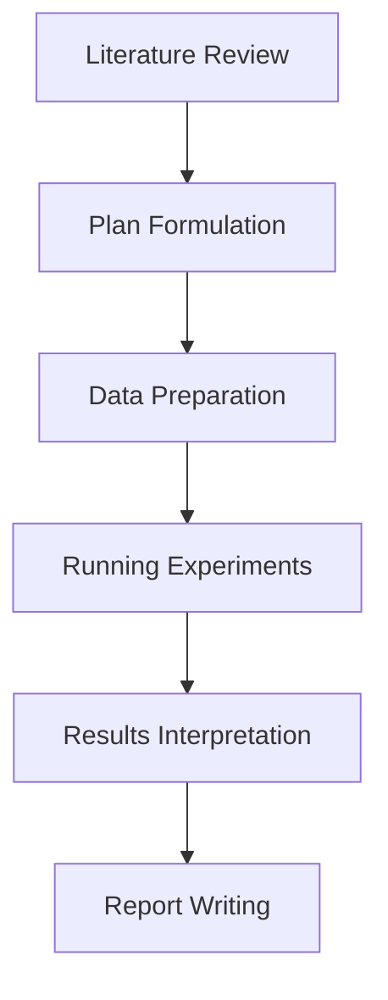

# Research Workflow Phases

This document describes the different phases of the research workflow in Agent Laboratory.

## Overview

Agent Laboratory divides the research process into distinct phases, each focused on a specific aspect of the research workflow. These phases are executed sequentially, with each phase building on the results of the previous phases.

The standard workflow includes the following phases:

1. Literature Review
2. Plan Formulation
3. Data Preparation
4. Running Experiments
5. Results Interpretation
6. Report Writing

## Phase Details

### 1. Literature Review

**Purpose**: Survey the existing literature to understand the current state of research on the topic.

**Activities**:
- Identify key papers, theories, and approaches related to the research topic
- Summarize important findings and methodologies
- Identify gaps in the existing literature
- Establish the theoretical foundation for the research

**Primary Agents**:
- PhD Student: Conducts the literature search and summarization
- Professor: Provides guidance on important areas to focus on

**Key Outputs**:
- Literature summary
- Key papers and findings
- Research gaps identified

**Example Configuration**:
```yaml
notes:
  literature_review:
    - "Focus on papers from the last 5 years"
    - "Identify both theoretical and practical approaches"
    - "Pay special attention to evaluation methodologies"
```

### 2. Plan Formulation

**Purpose**: Develop a detailed research plan based on the literature review.

**Activities**:
- Define specific research questions
- Outline methodologies and approaches
- Identify experiments to be conducted
- Create a timeline and resource allocation plan

**Primary Agents**:
- Professor: Guides the overall research direction
- PhD Student: Develops the detailed research plan
- Reviewers: Provide feedback on the plan

**Key Outputs**:
- Research plan document
- Experimental design
- Evaluation metrics

**Example Configuration**:
```yaml
notes:
  plan_formulation:
    - "Include both a baseline approach and a novel method"
    - "Define clear evaluation metrics"
    - "Consider computational resource requirements"
```

### 3. Data Preparation

**Purpose**: Prepare datasets, environments, and tools needed for the experiments.

**Activities**:
- Collect or generate datasets
- Preprocess and clean data
- Set up experimental environments
- Implement baseline models

**Primary Agents**:
- PhD Student: Coordinates data preparation activities
- ML Engineer: Implements data processing pipelines
- SW Engineer: Sets up development environments and tools

**Key Outputs**:
- Processed datasets
- Data preprocessing pipelines
- Experimental environment setup

**Example Configuration**:
```yaml
notes:
  data_preparation:
    - "Use standard preprocessing techniques from the literature"
    - "Create train/validation/test splits with appropriate ratios"
    - "Document all preprocessing steps for reproducibility"
```

### 4. Running Experiments

**Purpose**: Execute the experiments defined in the research plan.

**Activities**:
- Implement models and algorithms
- Run experimental trials
- Collect performance metrics
- Debug and iterate on implementations

**Primary Agents**:
- ML Engineer: Implements and runs machine learning experiments
- PhD Student: Oversees experimental process
- SW Engineer: Assists with implementation and optimization

**Key Outputs**:
- Experimental code
- Raw experimental results
- Implementation notes

**Example Configuration**:
```yaml
notes:
  running_experiments:
    - "Log all experimental parameters and results"
    - "Run each experiment with multiple random seeds"
    - "Monitor computational resources during execution"
```

### 5. Results Interpretation

**Purpose**: Analyze experimental results and draw conclusions.

**Activities**:
- Analyze performance metrics
- Compare different approaches
- Identify patterns and insights
- Draw conclusions about research questions

**Primary Agents**:
- PhD Student: Analyzes results and draws initial conclusions
- Professor: Provides guidance on interpretation
- ML Engineer: Assists with technical analysis

**Key Outputs**:
- Result analysis
- Performance comparisons
- Research conclusions
- Visualizations

**Example Configuration**:
```yaml
notes:
  results_interpretation:
    - "Perform statistical significance testing"
    - "Create visualizations for key results"
    - "Analyze failure cases and limitations"
```

### 6. Report Writing

**Purpose**: Document the research process and findings in a formal report.

**Activities**:
- Write up the research methodology
- Present and discuss results
- Create visualizations and tables
- Compile a complete research report
- Format and organize the report

**Primary Agents**:
- PhD Student: Writes the initial draft
- Professor: Reviews and provides feedback
- Reviewers: Provide feedback on the report

**Key Outputs**:
- Research report (LaTeX and PDF)
- Figures and tables
- References
- Appendices with additional details

**Example Configuration**:
```yaml
notes:
  report_writing:
    - "Follow standard academic paper structure"
    - "Include clear explanations of methodologies"
    - "Provide ablation studies for key components"
```

## Customizing the Workflow

The workflow can be customized by:

1. **Selecting Phases**: Include only the phases needed for your research
   ```yaml
   experiment:
     phases:
       - literature_review
       - plan_formulation
       - report_writing
   ```

2. **Adding Phase-Specific Notes**: Provide guidance for each phase
   ```yaml
   notes:
     literature_review:
       - "Focus on specific aspects..."
   ```

3. **Running Single Phases**: Execute just one phase of the workflow
   ```bash
   agent-lab --config my_experiment.yaml --phase running_experiments
   ```

4. **Human-in-the-Loop**: Enable interactive feedback during phases
   ```yaml
   experiment:
     human_in_loop: true
   ```

## Phase Dependencies

Phases are designed to build upon each other:



Output from each phase is stored and made available to subsequent phases, creating a continuous research narrative.

## Implementation Details

Each phase is implemented in the `LaboratoryWorkflow` class in `agent_lab/core/laboratory_workflow.py`. The workflow maintains state across phases and coordinates agent interactions within each phase.

The `perform_research()` method orchestrates the execution of the selected phases in sequence, while the `run_step()` method manages the execution of individual steps within each phase. 